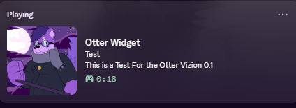
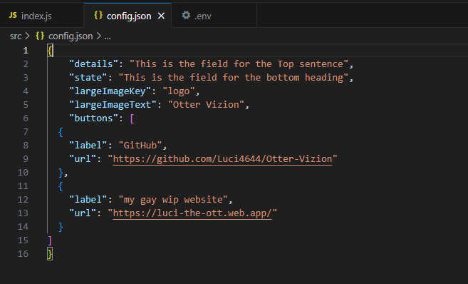
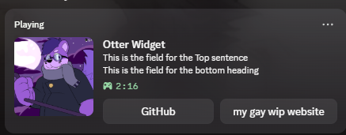

# OTTER VIZION
Otter Vizion is a lightweight Discord Rich Presence application built with Node.js.
It allows you to create a customizable Discord activity that can display information such as what youre doing, custom text, images, and clickable buttons.
## Features

- Custom Discord Rich Presence
- Configurable activity details and state
- Custom Discord application image
- Custom activity buttons
- Configuration through JSON
- Environment variables for the Discord Application ID
- Automatically updates the presence when the configuration changes

### Built With
-JAVASCRIPT
-node.js
-Discord RPC
-dotenv
## Screenshots

### Out The Box



### Changing Json



### Results/Button Showcase


## Requirements

- Node.js
- Discord desktop application
- A Discord Developer Application

## Installation

Clone the repository and install the dependencies:

```bash
npm install
Create a .env file in the project root: DISCORD_CLIENT_ID=YOUR_CLIENT_ID_HERE

Create your personal configuration by copying: src/config.example.json
to: src/config.json

Edit src/config.json with the Rich Presence information you want to display.

Running Otter Vizion

Make sure the Discord desktop application is running, then start Otter Vizion: node src/index.js

When the connection is successful, Otter Vizion will update your Discord Rich Presence.

Configuration

The Rich Presence can be customized through src/config.json.

Example:

{
  "details": "Working on Otter Vizion",
  "state": "Building something cool",
  "largeImageKey": "logo",
  "largeImageText": "Otter Vizion",
  "buttons": [
    {
      "label": "GitHub",
      "url": "https://github.com/"
    }
  ]
}

## Project Status

Otter Vizion is currently in early development (v0.1).
The current focus is building a reliable and configurable Discord Rich Presence application.
 
 Planned Improvements
More configurable presence options
Easier configuration management
Improved error handling
Additional activity features
Better user documentation
This project is currently available for personal and portfolio use.
